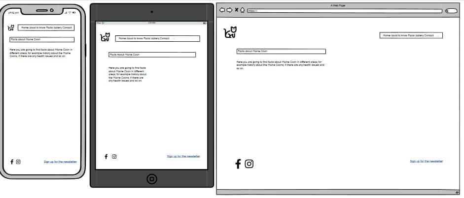
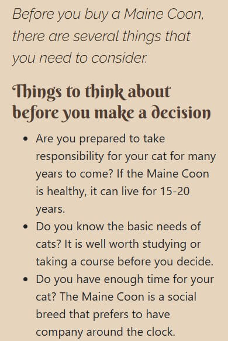
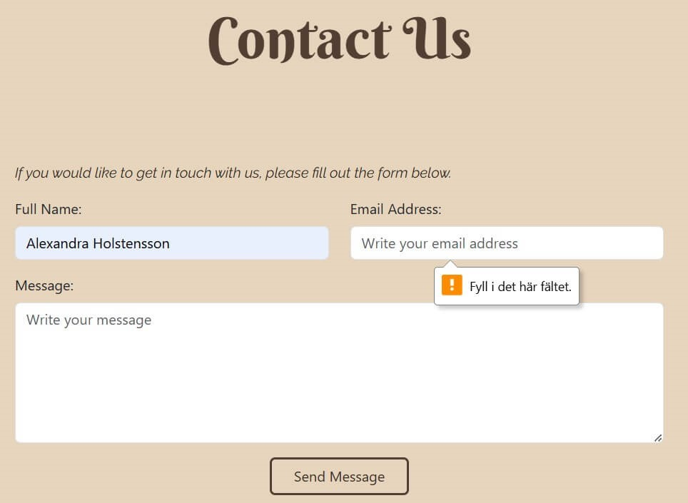
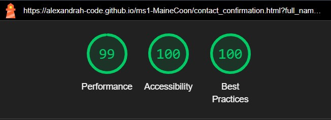

# Maine Coon Facts
Developer - Alexandra Holstensson

[Link to the project](https://alexandrah-code.github.io/ms1-MaineCoon/)

## Table of Contents
  * [About](#about)
  * [User Goals and User Stories](#user-goals-and-user-stories)
    * [External User Goals](#external-user-goals)
    * [Site Owner Goals](#site-owner-goals)
    * [User Stories](#user-stories)
  * [Design Of The Website](#design-of-the-website)
    * [Structure](#structure)
    * [Wireframes](#wireframes)
      * [Mobile Wireframes](#mobile-wireframes)
      * [Tablet Wireframes](#tablet-wireframes)
      * [Desktop Wireframes](#desktop-wireframes)
    * [Colors](#colors)
    * [Fonts](#fonts)
    * [Logo, Icons, Images and Text](#logo-icons-images-and-text)
      * [Logo](#logo)
      * [Icons](#icons)
      * [Images and Text](#images-and-text)
  * [Features](#features)
    * [Existing Features](#existing-features)
      * [Header](#header)
      * [Footer](#footer)
      * [Home Page](#home-page)
      * [Before You Buy A Cat page](#before-you-buy-a-cat-page)
      * [About The Maine Coon page](#about-the-maine-coon-page)
      * [Gallery page](#gallery-page)
      * [Contact page](#contact-page)
      * [Newsletter page](#newsletter-page)
    * [Features Left to Implement](#features-left-to-implement)
  * [Technologies Used](#technologies-used)
    * [Languages](#languages)
    * [Programs And Other Resources](#programs-and-other-resources)
  * [Testing](#testing)
    * [User Story Testing](#user-story-testing)
    * [Manual Testing](#manual-testing)
      * [Test links - navbar](#test-links---navbar)
      * [Test icons/link - footer](#test-iconslink---footer)
      * [Test link/button on Home Page](#test-linkbutton---home-page)
      * [Test links Before You Buy A Cat](#test-links---before-you-buy-a-cat-page)
      * [Test links About The Maine Coon](#test-links---about-the-maine-coon-page)
      * [Test form - Contact Page](#test-form---contact-page)
      * [Test form - Newsletter Page](#test-form---newsletter-page)
    * [Bugs](#bugs)
    * [Validation](#validation)
      * [HTML](#html)
      * [CSS](#css)
    * [Lighthouse Testing](#lighthouse-testing)
      * [Desktop](#desktop)
      * [Mobile](#mobile)
    * [Device Testing](#device-testing)
    * [Browser Compatibility](#browser-compatibility)

  * [Deployment](#deployment)

  * [Credits](#credits)
    * [Facts](#facts)
    * [Images](#images)

  * [Acknowledgments](#acknowledgments)

## About 
[(Back to top)](#index--table-of-contents)

Maine Coon Facts is a site where you will find
* information about what to think about before you buy a Maine Coon.
* information about the cat breed Maine Coon.
* a image galllery with images of Maine Coons, both adult cats and kittens.

## User Goals and User Stories
[(Back to top)](#index--table-of-contents)

  ### External User Goals

  * Find information about what you should think about if you are interested in buying a Maine Coon.
  * Find information about the Maine Coon cat breed.
  * Look at pictures of Maine Coons

  ### Site owner goals

  * Spark interest in the Maine Coon cat breed.
  * Inform about what you need to think about before buying a Maine Coon.
  * Inform about facts related to the Maine Coon cat breed.
  * Provide images of the Maine Coon cat breed (both adult cat and kitten images).

  ### User Stories

  * As a site visitor, I want it to be easy to navigate, to have clear headings so that it is easy to find the information I am looking for.

  * As a site visitor, I want it to have a layout that allows it (the page) to be used on any screen type, so that I am not dependent on a certain kind of device.

  * As a site visitor, I want it to be possible to contact the page owner so that I can get in touch with him/her if I have any questions/opinions.

  * As a first-time buyer, I want to be able to easily find information about what I need to consider before buying a cat so that I can be as well prepared as possible in the event of a purchase.

  * As a potential Maine Coon buyer, I want to be able to find specific information about the Maine Coon, such as temperament, appearance, specific breed traits, if Maine Coons have any diseases that you need to be aware of, etc., so that I can determine if it is a breed for me.

  * As a potential Maine Coon buyer, I would like to be able to see pictures of Maine Coons (of different ages and colors) to see what varieties there are.

  * As a Maine Coon owner, I want it to be possible to sign up for a newsletter, where you can find out more about Maine Coons, such as advice and tips. This is to be able to gain as much knowledge as possible about the breed and cat ownership.

## Design Of The Website
[(Back to top)](#index--table-of-contents)

  ### Structure
  
  I have chosen to structure my website as follows.
  
  * Home page
  * Before You Buy A Cat 
    * page with information about what you should consider before getting a cat/Maine Coon).
  * About The Maine Coon
    * page with information on the Maine Coon cat breed.
  * Gallery
    * page with images of Maine Coons (both adult cats and kittens)
  * Contact
    * page with a form where you can send a message to the (web)site owner.

  The pages above can be accessed by clicking on one of the links in the menu bar at the top of the page. On small screens (smaller than 1024 pixels) the menu is collapsed in the upper right corner). On larger screens (1024 pixels or more) there is a menu bar at the top of the page.

  At the bottom of the page there is a footer. In the footer there are links to social media (Facebook and Instagram) as well as a link to a page where you can use a form to sign up for a newsletter.

  ### Wireframes

  I have created the wireframes in Balsamiq. The final design doesn't match my wireframes exactly. However, they show how I intended to lay out the design of my site. I have also renamed two of the pages during the process, Good to know is now called Before You Buy A Cat and Facts is now called About The Maine Coon. I have made wireframes for mobile, tablet and desktop screen sizes.

  

  
Home Page

  
  
  

  

  
Before You Buy A Cat Page

  
  
  

  

  
About The Maine Coon Page

  
  
  

  

  
Gallery Page

  
  
  

  

  
Contact Page

  
  
  

  

  
Newsletter Page

  
  
  

  ### Colors

  I wanted to use natural colors. To get an idea of ​​what colors to use, I uploaded a picture of my Maine Coon Sunbeam to [Shutterstock's Color Palette Generator](https://www.shutterstock.com/sv/colors/color-palette-generator). In the image below, you can see the color palette that was generated after my image.

  

  I then used [WebAIM's Contrast Checker](https://webaim.org/resources/contrastchecker/) to see which colors have the best contrast with the background color (#E6D4BD).

  The result was the following:
  * #6F573C - Contrast Ratio 4.67:1
    * Passed on larger text (can be used on headings)
  * #523E33 - Contrast Ratio 6.92:1
    * Passed on larger text (can be used on headings)
  * #9A9694 - Contrast Ratio 2.02:1
    * Did not pass on any text
  * #2C251E - Contrast Ratio 10.44:1
    * Passed on all text

  The colors I chose to use from the color palette were these:
  * Greyish black - #2C251E (other text than headings)
  * Beige - #E6D4BD (background)
  * Dark brown - #523E33 (on headings)
  * Light brown - #6F573C (on headings)

  ### Fonts

  To figure out which fonts to use, I looked around a bit on the internet for fonts. I then found [Easil's “The Ultimate Free Font Pairing List”](https://about.easil.com/free-font-pairing-guide-templates/). Here I looked through the different options that were available. I came to the conclusion that I wanted a slightly "funnier" font that stands out on the headings and an easy-to-read font on other text. The option that stuck with me was the Berkshire Swash paired with Raleway or Oswald. on headings and Raleway or Oswald on other text. The final choice was to use Berkshire Swash on all the headings and Raleway on all the other text The fonts can be found at [Google Fonts](https://fonts.google.com/).

  [Berkshire Swash](https://fonts.google.com/specimen/Berkshire+Swash)

  [Raleway](https://fonts.google.com/specimen/Raleway)

  ### Logo, Icons, Images and Text

  #### Logo

  I have chosen to have a logo in the menu bar. The logo is created using [Favicon](https://favicon.io/favicon-converter/) (where I uploaded an image of my Maine Coon Sunbeam).

  #### Icons

  I have chosen to have icons in two places on the website:
  * as list item marker (a paw) in the short facts section of the home page
  * in the footer, where there are icons for Facebook and Instagram.

  The icons are from [Font Awesome](https://fontawesome.com/).  
  * [Paw](https://fontawesome.com/search?q=paw&o=r&m=free)
  * [Facebook](https://fontawesome.com/search?q=facebook&o=r&m=free) 
  * [Instagram](https://fontawesome.com/search?q=instagram&o=r&m=free)

  #### Images and Text

  Most images are downloaded from [Pixabay](https://pixabay.com/). The exceptions are the image on the home page which is my own (an image of my Maine Coon Sunbeam) and the image on the About The Maine Coon page which is from [Free Images](https://www.freeimages.com/). A compilation of images and owners/photographers can be found under Credits.

  The images have been modified to fit the website (they have been compressed to take up less space and have been resized to fit it).

  I have found the information for the fact-rich pages on a couple of Swedish websites about the Maine Coon (See Credits). I have translated this information into English (using Google Translate to make it more accurate).

## Features
[(Back to top)](#index--table-of-contents)

  ### Existing Features

  #### Header

  In the header there is a navbar consisting of a logo and links to the website's various pages (HOME, BEFORE YOU BUY A CAT, ABOUT THE MAINE COON, GALLERY and CONTACT). 

  The nav bar is from [Bootstrap](https://getbootstrap.com/).

  The navbar that I have based mine on is [this one](https://getbootstrap.com/docs/5.3/components/navbar/#nav). I have then modified it the way I want it and with the colors I have chosen to use.

  The navbar on screens that are 1024px or larger.

  

  The navbar has a hover effect on screens larger than 1024px. When you move the mouse pointer over each page in the navbar, the color of the text changes.

  

  The navbar on screens that are smaller than 1024 pixels, the links become a toggle menu on the right of the navbar.

  

  In order to solve so that the menu toggles on small screens, I am using a JavaScript here. (The JavaScript was used in the Boardwalk Games Walkthrough)

  #### Footer

  The footer consists of two icons (one for Facebook and one for Instagram) and a SIGN UP FOR OUR NEWSLETTER link (goes to a page where you, via a form, can sign up for the page's newsletter).

  

  On large screens (1024 px or more), the icons and link have a hover effect (their color changes). I have chosen to use the same color as in the nav bar.

  

  #### Home Page

  The home page consists of the following parts (besides the navbar and footer), header and main.

  In the header, there is a large heading (h1) and an image of a Maine Coon (image of my own Maine Coon Sunbeam).

  

  Main consists of two different sections: start_info and shorter_facts.

  In start_info there is an h2 heading (which welcomes you to the page) and a paragraph describing what the website contains.

  

  Below the start_info section comes the shorter_facts section. It consists of an h3 heading and a list of shorter facts about the Maine Coon. At the bottom of the section is a button that directs the visitor to the About The Maine Coon page. Here is my thought that the facts about the Maine Coon are probably the biggest reason why you enter the site. And that it is also logical that you can get to more facts about the Maine Coon in a section that gives shorter facts about it.

  The list of shorter facts changes depending on the screen size. On small screens (up to 768 px) it is a single column. 

  
  
  On screens larger than 768px (but smaller than 1024px), the list splits into two columns and a column in the middle below the top two.

  

  On 1024 px screens or larger, the list splits into three columns.

  

  The button below the shorter facts section has a hover effect. When you move the mouse pointer over it, the background and text color changes.

  

  #### Before You Buy A Cat Page

  Before You Buy A Cat page consists of the following parts (besides navbar and footer): header and main.

  Header consists of two columns. In the left column is a large heading (h1) and a menu with two links that go to the two sections of the page (the menu is an unordered list). In the column on the right there is an image of a Maine Coon downloaded from Pixabay (owner/photographer Claudia Wollesen, see Credits)

  On screens smaller than 1024 px, the image is placed below the heading and menu.

  

  On screens larger than 1024 px, the header splits into two columns.
  
  

  Main consists of two different sections: before_cat_decision and before_cat_buying. 
  
  before_cat_decision consists of a paragraph (with lead class), an h2 heading and an (unordered) bulleted list of things you need to think about before making a decision to get a Maine Coon.

  
  

  before_cat_buying consists of a combination of headings (h2 and h3), paragraphs and lists (both unordered and ordered). The section is about what you need to think about after you have decided to buy a Maine Coon, but before you make the actual purchase.

  
  

  The section is longer but I have chosen to include only two pictures of it here.

  #### About The Maine Coon Page

  About The Maine Coon page consists of the following parts (besides navbar and footer): header and main.

  Header consists of two columns. In the column on the left is a large heading (h1) and a menu with links that go to the different sections of the page (the menu is an unordered list). In the column on the right is a picture of three Maine Coon kittens that I downloaded from Free Images (owner/photographer johnnyberg, see Credits)

  On screens smaller than 1024 px, the image goes under the header and menu.

  

  On screens that are 1024 px or larger, the header splits into two columns.

  

  Main consists of the following sections: Origin, Appearance, Personality, Health, Nutrition And Feeding, Fur Care and Child Friendliness. Each section consists of an h2 heading and a paragraph (with the facts to which the heading applies).

  

  The content is placed in the center of the page on screens larger than 1024px.

  

  After Origin, the other sections follow. But I have chosen to only include images of the first section here.

  #### Gallery Page

  Gallery consists of the following parts (besides navbar and footer): header and main.

  Header consists of an h1 heading. On this page I have chosen not to have an image in the header as it only contains images (it feels unnecessary to have one in the header then).

  

  Main contains one section, image_gallery. image_gallery consists of an h2 header and a row of images. The images are displayed in one, two or three columns depending on the screen size.

  Screens smaller than 768px:

  

  Screens 768px or larger, but smaller than 1024px:

  

  Screens 1024px or larger:

  

  The images above show a part of the Gallery page.

  #### Contact Page

  Gallery consists of the following parts (besides navbar and footer): header and main.

  Header consists of an h1 heading. I have chosen not to have any images on this page (to keep it as "clean" as possible).

  

  Consists of one section, contact_form. contact_form consists of one paragraphs and a form. The form consists of three text fields (Full Name, Email Address and Message) and a Send Message button. The appearance of the form changes with screen size.

  Screens smaller than 768px:

  

  Screens 768px or larger:

  

  For the appearance of the button I have used Bootstrap 5.3 ([btn custom-button-outline class](https://getbootstrap.com/docs/5.3/components/buttons/#outline-buttons)) combined with my own CSS.

  There is a hover effect on the button (on larger screens). When you move the mouse pointer over it, the background and text color changes.

  

  #### Newsletter Page

  Gallery consists of the following parts (besides navbar and footer): header and main.

  Header consists of an h1 heading. I have chosen not to have any images on this page (to keep it as "clean" as possible)

  

  Main consists of one section, newsletter_form. newsletter_form consists of two paragraphs and a form. The form consists of two text fields (Full Name and Email Address) and a Sign Up button. The appearance of the form changes with screen size.

  Screens smaller than 768px:

  

  Screens 768px or larger:

  

  For the appearance of the button I have used Bootstrap 5.3 ([btn custom-button-outline](https://getbootstrap.com/docs/5.3/components/buttons/#outline-buttons)) combined with my own CSS.

  There is a hover effect on the button (on larger screens). When you move the mouse pointer over it, the background and text color changes.

  

  ### Features Left To Implement

  There are two features that I think could be added to the site in the future.

  * List of breeders (divided, for example, by area, city, etc.)
  * Ability to search the website

## Technologies Used
[(Back to top)](#index--table-of-contents)

### Languages

* [HTML5](https://en.wikipedia.org/wiki/HTML)
* [CSS](https://en.wikipedia.org/wiki/CSS)
* [JavaScript](https://en.wikipedia.org/wiki/JavaScript)

### Programs And Other Resources

* [Responsinator](http://www.responsinator.com/) - Used to check how the site looks on different devices and how responsive it is
* [Am I Responsive](https://ui.dev/amiresponsive) - Used to check how the site looks on different devices and how responsive it is
* [tinypng](https://tinypng.com/) - Used to compress images
* [HTML Validator](https://validator.w3.org/nu/) - Used to validate the HTML files
* [CSS Validator](https://jigsaw.w3.org/css-validator/) - Used to validate the CSS file
* [WebAIM Contrast Checker](https://webaim.org/resources/contrastchecker/) - Used to check the color contrast
* [Bootstrap, v5.3](https://getbootstrap.com/) - Used Boostrap to structure the pages and found parts for some functions here
  * [Navbar](https://getbootstrap.com/docs/5.3/components/navbar/#nav) - Started from Bootstrap's navbar but modified it to fit my site.
  * [Form control](https://getbootstrap.com/docs/5.3/forms/form-control/) - Contact and Newsletter page
  * [Button design](https://getbootstrap.com/docs/5.3/components/buttons/#outline-buttons) - Used for the design of the buttons on the Start, Contact and Newsletter page.
* [Windows Photo-app](https://www.microsoft.com/en-us/windows/photo-movie-editor?r=1) - Used to resize images as well as to remove the background of the image on the Home page.
* [Shutterstock's color palette generator](https://www.shutterstock.com/sv/colors/color-palette-generator) - Used to create a color palette for the page.
* [Favicon](https://favicon.io/favicon-converter/) - Used to create the logo in the navbar.
* [Fontawsome](https://fontawesome.com/) - The icons for Facebook and Instagram in the footer and the paw icon in the list on the home page come from here.
  * [Facebook icon](https://fontawesome.com/search?q=facebook&o=r&m=free)
  * [Instagram icon](https://fontawesome.com/search?q=instagram&o=r&m=free)
  * [Paw icon](https://fontawesome.com/search?q=paw&o=r&m=free)
* [Google Translate](https://translate.google.com/) - Used for translating Swedish texts into English

## Testing
[(Back to top)](#index--table-of-contents)

### User Story Testing

| Feature | User Story | Expected Result | Pass |
|---------|------------|-----------------|------|
| Navbar  | As a site visitor, I want it to be easy to navigate, to have clear headings so that it is easy to find the information I am looking for. | It is easy to navigate on the site and it has headings that clearly describes what you can expect for information. | &check; |
| Entire website | As a site visitor, I want it to have a layout that allows it (the page) to be used on any screen type, so that I am not dependent on a certain kind of device. | That the site is responsive, that you can visit the site from any type of device and any screen size. | &check; |
| Before You Buy A Cat page | As a first-time buyer, I want to be able to easily find information about what I need to consider before buying a cat so that I can be as well prepared as possible in the event of a purchase. | The site offers a page where you can find information about what you should think about before you buy a Maine Coon. | &check; |
| About The Maine Coon page | As a potential Maine Coon buyer, I want to be able to find specific information about the Maine Coon, such as temperament, appearance, specific breed traits, if Maine Coons have any diseases that you need to be aware of, etc., so that I can determine if it is a breed for me. | The site offers a page where you can find more specific information about the Maine Coon. | &check; |
| Gallery page | As a potential Maine Coon buyer, I would like to be able to see pictures of Maine Coons (of different ages and colors) to see what varieties there are. | The site offers a page where you can find images of Maine Coons (both adult cats and kittens). | &check; |
| Contact page and Footer | As a site visitor, I want it to be possible to contact the page owner so that I can get in touch with him/her if I have any questions/opinions. | The site offers a contact form where you can send a message to the site owner. There is also links to social media in the footer (a potential way to contact the site owner). | &check; |
| Newsletter page | As a Maine Coon owner, I want it to be possible to sign up for a newsletter, where you can find out more about Maine Coons, such as advice and tips. This is to be able to gain as much knowledge as possible about the breed and cat ownership. | In the footer you can click on a Sign up for our newsletter link. The link takes you to a form where you can sign up for the newsletter. | &check; |

### Manual Testing

#### Test links - navbar

| Link | Action |
|------|--------|
| Logo | When you click on the logo you will be taken to index.html (the Home Page) |
| BEFORE YOU BUY A CAT | When you click on BEFORE YOU BUY A CAT you will be taken to before_cat.html (Before You Buy A Cat) |
| ABOUT THE MAINE COON | When you click on ABOUT THE MAINE COON you will be taken to about_the_mc.html (ABbout The Maine Coon) |
| GALLERY | When you click on GALLERY you will be taken to gallery.html (Gallery) |
| CONTACT | When you click on CONTACT you will be taken to contact.html (Contact Us) |

The links in the navbar work as they should.

#### Test icons/link - footer

| Link | Action |
|------|--------|
| Icon Facebook | When you click on the icon, Facebook opens in a new tab or in a new window. |
| Icon Instagram | When you click on the icon, Instagram opens in a new tab or in a new window. |
| SIGN UP FOR OUR NEWSLETTER link | When you click on the link, you will be taken to the Newsletter page where, via a form, you can sign up for the newsletter. |

The links in the footer work as they should.

#### Test link/button - Home Page

When you click on the link/button on the Home Page, you will be taken to the page where there are more facts about the Maine Coon, that is, on the About The Maine Coon page (about_the_mc.html).

The link/button works as it should.

#### Test links - Before You Buy A Cat Page

| Link | Action |
|------|--------|
| Before You Make A Decision | When you click on the link, you will be taken to the Things to think about before you make a decision section on the page |
| Before You Buy A Cat | When you click on the link, you will be taken to the Things to think about before buying section of the page |

The links on the Before You Buy A Cat page are working properly.

#### Test links - About The Maine Coon Page

| Link | Action |
|------|--------|
| Origin | Link that takes you to the Origin section of the page |
| Appearance | Link that takes you to the Appearance section of the page |
|Personality | Link that takes you to the Personality section of the page |
| Health | Link that takes you to the Health section of the page |
| Nutrition And Feeding | Link that takes you to the Nutrition And Feeding section of the page |
| Fur Care | Link that takes you to the Fur Care section of the page |
| Child Friendliness | Link that takes you to the Child Friendliness section of the page |

The links on the About The Maine Coon Page are working properly. When it comes to the last two links, clicking on them does not take you to exactly the right place on the page (depending on the type of device/screen size used). Something that I assume is due to the page being too short. In any case, the linking itself is correct also for the last two sections.

#### Test form - Contact Page

If you try to send the form without filling in all the fields, you get an error message (which points to the first field that is not filled in). The error message appears regardless of which field it is that has not been filled in.

If you fill in all the fields and click on the Send Message button, you end up on a page (contact_confirmation.html) that shows that the message has been sent.

#### Test form - Newsletter Page

If you try to send the form without filling in all the fields, you get an error message (which points to the first field that is not filled in). The error message appears regardless of which field it is that has not been filled in.

If you fill in all the fields and click on the Send Message button, you end up on a page (newsletter_confirmation.html) that shows that the message has been sent.

### Bugs

| Problem | Solution | Source of help |
|---------|----------|----------------|
| Images weren't responsive (didn't keep up with screen size) | Inserted img { width: 100%; height: auto;} in the CSS file | [W3schools - Responsive Web Design - Images](https://www.w3schools.com/css/css_rwd_images.asp) and [W3Schools - CSS Styling Images](https://www.w3schools.com/css/css3_images.asp) |
| When you click on one of the links on the About The Maine Coon page, you end up under the heading (navbars hide the heading). |I add padding-top corresponding to the height of the navbar (in my case 68px) to the section | Reminds me we had similar issues in the Boardwalk Games walkthrough. So I looked at the code of that project to get an idea of ​​how to solve the problem. |
| After I put information under Sections it looks like the pages move sideways when going from one page to another. | Added overflow-y:scroll; under html in the css file | [Stack Overflow - Website layout moving slightly between pages - how to stop it](https://stackoverflow.com/questions/8975174/website-layout-moving-slightly-between-pages-how-to-stop-it) and [Stack Overflow - How to prevent scrollbar from repositioning web page?](https://stackoverflow.com/questions/1417934/how-to-prevent-scrollbar-from-repositioning-web-page) |

### Validation

#### HTML

All pages passed the W3C Markup Validator without any errors.

[Home Page](https://validator.w3.org/nu/?doc=https%3A%2F%2Falexandrah-code.github.io%2Fms1-MaineCoon%2Findex.html)

[Before You Buy A Cat Page](https://validator.w3.org/nu/?doc=https%3A%2F%2Falexandrah-code.github.io%2Fms1-MaineCoon%2Fbefore_cat.html)

[About The Maine Coon Page](https://validator.w3.org/nu/?doc=https%3A%2F%2Falexandrah-code.github.io%2Fms1-MaineCoon%2Fabout_the_mc.html)

[Gallery Page](https://validator.w3.org/nu/?doc=https%3A%2F%2Falexandrah-code.github.io%2Fms1-MaineCoon%2Fgallery.html)

[Contact Page](https://validator.w3.org/nu/?doc=https%3A%2F%2Falexandrah-code.github.io%2Fms1-MaineCoon%2Fcontact.html)

[Contact Confirmation Page](https://validator.w3.org/nu/?doc=https%3A%2F%2Falexandrah-code.github.io%2Fms1-MaineCoon%2Fcontact_confirmation.html)

[Newsletter Page](https://validator.w3.org/nu/?doc=https%3A%2F%2Falexandrah-code.github.io%2Fms1-MaineCoon%2Fnewsletter.html)

[Newsletter Confirmation Page](https://validator.w3.org/nu/?doc=https%3A%2F%2Falexandrah-code.github.io%2Fms1-MaineCoon%2Fnewsletter_confirmation.html)

#### CSS

The CSS file went through the W3C CSS Validator without showing any errors.

[Link to W3C's CSS Validation Service](https://jigsaw.w3.org/css-validator/validator?uri=https%3A%2F%2Falexandrah-code.github.io%2Fms1-MaineCoon%2Findex.html&profile=css3svg&usermedium=all&warning=1&vextwarning=&lang=sv)

### Lighthouse Testing

#### Desktop

  

  
Home Page

  
  
  

  
  

  
Before You Buy A Cat Page

  
  
  

  

  
About The Maine Coon Page

  
  
  

  

  
Gallery Page

  
  
  

  

  
Contact Page

  
  
  

  

  
Contact Confirmation Page

  
  
  

  

  
Newsletter Page

  
  
  

  

  
Newsletter Confirmation Page

  
  
  

#### Mobile

  

  
Home Page

  
  
  

  
  

  
Before You Buy A Cat Page

  
  
  

  

  
About The Maine Coon Page

  
  
  

  

  
Gallery Page

  
  
  

  

  
Contact Page

  
  
  

  

  
Contact Confirmation Page

  
  
  

  

  
Newsletter Page

  
  
  

  

  
Newsletter Confirmation Page

  
  
  

### Device Testing

I have tested the site on the devices below to ensure that the site works as it should and is responsive. The site has worked properly on both devices.

* Samsung Galaxy S24 Ultra
* Samsung Galaxy Tab S8

I have also tested my site on [Am I Responsive](https://ui.dev/amiresponsive) and [Responsinator](http://www.responsinator.com/) to see how it looks on other devices and if it is responsive.

### Browser Compatibility

In addition to Google Chrome, I have tested the website in the following browsers. The site works as well in them as it does in Google Chrome, the site is responsive and it works as it should otherwise.

* Microsoft Edge
* Opera
* Firefox

## Deployment
[(Back to top)](#index--table-of-contents)

This project was deployed to GitHub pages. To deploy the project, follow these steps:
  * In the GitHub repository, navigate to the Settings tab (last option in the top menu bar)
  * Then click on Pages in the vertical menu bar on the left.
  * Under Build and deployment
    * select Deploy from a branch under Source.
    * select and main (root) under Branch.
  * Then click on the Save button.
  * Back in the repository, you may have to wait a while before the deployment is complete.
  * The page can then be found under Deployments in the vertical menu bar on the right.
  * Click on github-pages and there is a link to the page.

Link to the project - https://alexandrah-code.github.io/ms1-MaineCoon/

## Credits
[(Back to top)](#index--table-of-contents)

### Facts

  The text on the Before You Buy A Cat page comes from the Swedish website [Maine Coon Katten](https://mainecoonkatten.se/att-t-nka-p/).

  The list of bullet points on the home page (Some Shorter Facts About The Maine Coon) and the text on About The Maine Coon page comes from the Swedish website [Purina](https://www.purina.se/hitta-ett-husdjur/kattraser/maine-coon). 

  I have translated the texts above into English.

### Images

* The image (Sunbeam_20240624_mod_2.jpg) that is on the home page was taken by me and it is of my Maine Coon Sunbeam.

The other images have been downloaded from Pixabay and Free Images.

| Page | File title on the site | Downloaded From | Photographer/Owner |
|------|------------|-----------------|--------------------|
| Before You Buy A Cat | maine-coon-694730_640.jpg | [Pixabay](https://pixabay.com/sv/photos/maine-coon-katt-kattens-%C3%B6gon-694730/) | ClaudiaWollesen |
| About The Maine Coon | maine-coons-kittens-1247058_1.jpg | [Free Images](https://www.freeimages.com/photo/maine-coons-kittens-1247058) | johnnyberg |
| Gallery | cat-7436051_640.jpg | [Pixabay](https://pixabay.com/sv/photos/katt-maine-coon-kattunge-s%C3%B6t-kitty-7436051/) | miezekieze |
| Gallery | maine-coon-7954384_640.jpg | [Pixabay](https://pixabay.com/sv/photos/maine-coon-katter-tabby-husdjur-7954384/) | miezekieze |
| Gallery | cat-7779237_640.jpg| [Pixabay](https://pixabay.com/sv/photos/katt-maine-coon-tamdjur-huskatten-7779237/) | brisch27 |
| Gallery | maine-coon-5778153_640.jpg| [Pixabay](https://pixabay.com/sv/photos/maine-coon-katt-s%C3%A4llskapsdjur-5778153/) | Kanashi |
| Gallery | cat-5919989_640.jpg| [Pixabay](https://pixabay.com/sv/photos/katt-kattdjur-ingef%C3%A4ra-p%C3%A4ls-s%C3%B6t-5919989/) | ottawagraphics |
| Gallery | cat-694718_640.jpg| [Pixabay](https://pixabay.com/sv/photos/katt-djur-tamdjur-maine-coon-694718/) | ClaudiaWollesen |
| Gallery | cat-7204914_640.jpg | [Pixabay](https://pixabay.com/sv/photos/katt-maine-coon-s%C3%A4llskapsdjur-7204914/) | miezekieze |
| Gallery | cat-7762873_640.jpg| [Pixabay](https://pixabay.com/sv/photos/katt-maine-coon-firande-guld-7762873/) | miezekieze |
| Gallery | maine-coon-7947956_640.jpg| [Pixabay](https://pixabay.com/sv/photos/maine-coon-katter-kattungar-husdjur-7947956/) | miezekieze |
| Gallery | cat-3092784_640.jpg| [Pixabay](https://pixabay.com/sv/photos/katt-silver-gr%C3%A5-maine-coon-3092784/) | Lepale |
| Gallery | cat-3092804_640.jpg| [Pixabay](https://pixabay.com/sv/photos/katt-kattunge-gr%C3%A5-svart-maine-coon-3092804/) | Lepale |
| Gallery | cat-4523687_640.jpg| [Pixabay](https://pixabay.com/sv/photos/katt-vit-silver-%C3%B6ga-kattdjur-4523687/) | Lepale |

## Acknowledgments
[(Back to top)](#index--table-of-contents)

Thanks to my mentor Antonio Rodriguez for advice and tips during the project.

 