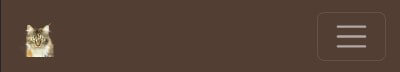
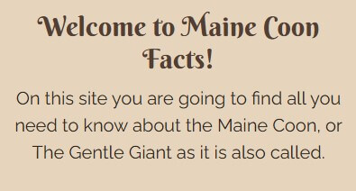

# Maine Coon Facts

[Link to the project](https://alexandrah-code.github.io/ms1-MaineCoon/)

## Index – Table of Contents
  * [About](#about)
  * [User Goals and User Stories](#user-goals-and-user-stories)
    * [External User Goals](#external-user-goals)
    * [Site Owner Goals](#site-owner-goals)
    * [User Stories](#user-stories)
  * [Design Of The Website](#design-of-the-website)
    * [Structure](#structure)
    * [Wireframes](#wireframes)
      * [Mobile Wireframes](#mobile-wireframes)
      * [Tablet Wireframes](#tablet-wireframes)
      * [Desktop Wireframes](#desktop-wireframes)
    * [Colors](#colors)
    * [Fonts](#fonts)
    * [Logo, Icons, Images and Text](#logo-icons-images-and-text)
      * [Logo](#logo)
      * [Icons](#icons)
      * [Images](#images)
  * [Features](#features)
    * [Existing Features](#existing-features)
      * [Header](#header)
      * [Footer](#footer)
      * [Home Page](#home-page)
      * [Before You Buy A Cat page](#before-you-buy-a-cat-page)
      * [About The Maine Coon page](#about-the-maine-coon-page)
      * [Gallery page](#gallery-page)
      * [Contact page](#contact-page)
      * [Newsletter page](#newsletter-page)
    * [Features Left to Implement](#features-left-to-implement)
  * [Technologies Used](#technologies-used)
    * [Languages Used](#languages-used)
    * [Programs Used](#programs-used)
    * [Other Resources](#other-resources)
  * [Testing](#testing)
    * [User Story Testing](#user-story-testing)
    * [Manual Testing](#manual-testing)
    * [Bugs](#bugs)
    * [Validation](#validation)
      * [HTML](#html)
      * [CSS](#css)
    * [Accessibility Testing](#accessibility-testing)
    * [Lighthouse Testing](#lighthouse-testing)
    * [Device Testing](#device-testing)
    * [Browser Compatibility](#browser-compatibility)

  * [Deployment](#deployment)

  * [Credits](#credits)
    * [Content](#content)
    * [Media And Images](#media-and-images)

## About 
[(Back to top)](#index--table-of-contents)

Maine Coon Facts is a site where you will find
* information about what to think about before you buy a Maine Coon.
* information about the cat breed Maine Coon.
* a image galllery with images of Maine Coons, both adult cats and kittens.

## User Goals and User Stories
  ### External User Goals
  [(Back to top)](#index--table-of-contents)

  * Find information about what you should think about if you are interested in buying a Maine Coon.
  * Find information about the Maine Coon cat breed.
  * Look at pictures of Maine Coons

  ### Site owner goals
  [(Back to top)](#index--table-of-contents)

  * Spark interest in the Maine Coon cat breed.
  * Inform about what you need to think about before buying a Maine Coon.
  * Inform about facts related to the Maine Coon cat breed.
  * Provide images of the Maine Coon cat breed (both adult cat and kitten images).

  ### User Stories
  [(Back to top)](#index--table-of-contents)
  * As a site visitor, I want it to be easy to navigate, to have clear headings so that it is easy to find the information I am looking for.

  * As a site visitor, I want it to have a layout that allows it (the page) to be used on any screen type, so that I am not dependent on a certain kind of device.

  * As a site visitor, I want it to be possible to contact the page owner so that I can get in touch with him/her if I have any questions/opinions.

  * As a first-time buyer, I want to be able to easily find information about what I need to consider before buying a cat so that I can be as well prepared as possible in the event of a purchase.

  * As a potential Maine Coon buyer, I want to be able to find specific information about the Maine Coon, such as temperament, appearance, specific breed traits, if Maine Coons have any diseases that you need to be aware of, etc., so that I can determine if it is a breed for me.

  * As a potential Maine Coon buyer, I would like to be able to see pictures of Maine Coons (of different ages and colors) to see what varieties there are.

  * As a Maine Coon owner, I want it to be possible to sign up for a newsletter, where you can find out more about Maine Coons, such as advice and tips. This is to be able to gain as much knowledge as possible about the breed and cat ownership.

## Design Of The Website
  ### Structure
  [(Back to top)](#index--table-of-contents)
  
  I have chosen to structure my website as follows.
  
  * Home page
  * Before You Buy A Cat 
    * page with information about what you should consider before getting a cat/Maine Coon).
  * About The Maine Coon
    * page with information on the Maine Coon cat breed.
  * Gallery
    * page with images of Maine Coons (both adult cats and kittens)
  * Contact
    * page with a form where you can send a message to the (web)site owner.

  The pages above can be accessed by clicking on one of the links in the menu bar at the top of the page. On small screens (smaller than 1024 pixels) the menu is collapsed in the upper right corner). On larger screens (1024 pixels or more) there is a menu bar at the top of the page.

  At the bottom of the page there is a footer. In the footer there are links to social media (Facebook and Instagram) as well as a link to a page where you can use a form to sign up for a newsletter.

  ### Wireframes
  [(Back to top)](#index--table-of-contents)

  I have created the wireframes in Balsamiq. The final design doesn't match my wireframes exactly. However, they show how I intended to lay out the design of my site. I have also renamed two of the pages during the process, Good to know is now called Before You Buy A Cat and Facts is now called About The Maine Coon. I have made wireframes for mobile, tablet and desktop screen sizes.

  

  
Home Page

  
  
  

  

  
Before You Buy A Cat Page

  
  
  

  

  
About The Maine Coon Page

  
  
  

  

  
Gallery Page

  
  
  

  

  
Contact Page

  
  
  

  

  
Newsletter Page

  
  
  

  ### Colors
  [(Back to top)](#index--table-of-contents)

  I wanted to use natural colors. To get an idea of ​​what colors to use, I uploaded a picture of my Maine Coon Sunbeam to [Shutterstock's Color Palette Generator](https://www.shutterstock.com/sv/colors/color-palette-generator). In the image below, you can see the color palette that was generated after my image.

  

  I then used [WebAIM's Contrast Checker](https://webaim.org/resources/contrastchecker/) to see which colors have the best contrast with the background color (#E6D4BD).

  The result was the following:
  * #6F573C - Contrast Ratio 4.67:1
    * Passed on larger text (can be used on headings)
  * #523E33 - Contrast Ratio 6.92:1
    * Passed on larger text (can be used on headings)
  * #9A9694 - Contrast Ratio 2.02:1
    * Did not pass on any text
  * #2C251E - Contrast Ratio 10.44:1
    * Passed on all text

  The colors I chose to use from the color palette were these:
  * Greyish black - #2C251E (other text than headings)
  * Beige - #E6D4BD (background)
  * Dark brown - #523E33 (on headings)
  * Light brown - #6F573C (on headings)

  ### Fonts
  [(Back to top)](#index--table-of-contents)

  To figure out which fonts to use, I looked around a bit on the internet for fonts. I then found [Easil's “The Ultimate Free Font Pairing List”](https://about.easil.com/free-font-pairing-guide-templates/). Here I looked through the different options that were available. I came to the conclusion that I wanted a slightly "funnier" font that stands out on the headings and an easy-to-read font on other text. The option that stuck with me was the Berkshire Swash paired with Raleway or Oswald. on headings and Raleway or Oswald on other text. The final choice was to use Berkshire Swash on all the headings and Raleway on all the other text The fonts can be found at [Google Fonts](https://fonts.google.com/).

  [Berkshire Swash](https://fonts.google.com/specimen/Berkshire+Swash)

  [Raleway](https://fonts.google.com/specimen/Raleway)

  ### Logo, Icons, Images and Text
  [(Back to top)](#index--table-of-contents)
  #### Logo

  I have chosen to have a logo in the menu bar. The logo is created using [Favicon](https://favicon.io/favicon-converter/) (where I uploaded an image of my Maine Coon Sunbeam).

  #### Icons

  I have chosen to have icons in two places on the website:
  * as list item marker (a paw) in the short facts section of the home page
  * in the footer, where there are icons for Facebook and Instagram.

  The icons are from [Font Awesome](https://fontawesome.com/).  
  * [Paw](https://fontawesome.com/search?q=paw&o=r&m=free)
  * [Facebook](https://fontawesome.com/search?q=facebook&o=r&m=free) 
  * [Instagram](https://fontawesome.com/search?q=instagram&o=r&m=free)

  #### Images

  Most images are downloaded from [Pixabay](https://pixabay.com/). The exceptions are the image on the home page which is my own (an image of my Maine Coon Sunbeam) and the image on the About The Maine Coon page which is from [Free Images](https://www.freeimages.com/). A compilation of images and owners/photographers can be found under Credits.

  The images have been modified to fit the website (they have been compressed to take up less space and have been resized to fit it).

  #### Text

  I have found the information for the fact-rich pages on a couple of Swedish websites about the Maine Coon. I have translated this information into English (using Google Translate to make it more accurate).

  The text on the Before You Buy A Cat page comes from [Maine Coon Katten](https://mainecoonkatten.se/att-t-nka-p/) and the text on About The Maine Coon page comes from [Purina](https://www.purina.se/hitta-ett-husdjur/kattraser/maine-coon). 

## Features
  ### Existing Features
  #### Header
  [(Back to top)](#index--table-of-contents)

  In the header there is a navbar consisting of a logo and links to the website's various pages (HOME, BEFORE YOU BUY A CAT, ABOUT THE MAINE COON, GALLERY and CONTACT). 

  The nav bar is from [Bootstrap](https://getbootstrap.com/).

  The navbar that I have based mine on is [this one](https://getbootstrap.com/docs/5.3/components/navbar/#nav). I have then modified it the way I want it and with the colors I have chosen to use.

  The navbar on screens that are 1024px or larger.

  

  The navbar has a hover effect on screens larger than 1024px. When you move the mouse pointer over each page in the navbar, the color of the text changes.

  

  The navbar on screens that are smaller than 1024 pixels, the links become a toggle menu on the right of the navbar.

  

  #### Footer
  [(Back to top)](#index--table-of-contents)

  The footer consists of two icons (one for Facebook and one for Instagram) and a SIGN UP FOR OUR NEWSLETTER link (goes to a page where you, via a form, can sign up for the page's newsletter).

  

  On large screens (1024 px or more), the icons and link have a hover effect (their color changes). I have chosen to use the same color as in the nav bar.

  

  #### Home Page
  [(Back to top)](#index--table-of-contents)

  The home page consists of the following parts (besides the navbar and footer), header and main.

  In the header, there is a large heading (h1) and an image of a Maine Coon (image of my own Maine Coon Sunbeam).

  

  Main consists of two different sections: start_info and shorter_facts.

  In start_info there is an h2 heading (which welcomes you to the page) and a paragraph describing what the website contains.

  

  Below the start_info section comes the shorter_facts section. It consists of an h3 heading and a list of shorter facts about the Maine Coon. At the bottom of the section is a button that directs the visitor to the About The Maine Coon page. Here is my thought that the facts about the Maine Coon are probably the biggest reason why you enter the site. And that it is also logical that you can get to more facts about the Maine Coon in a section that gives shorter facts about it.

  The list of shorter facts changes depending on the screen size. On small screens (up to 768 px) it is a single column. 

  
  
  On screens larger than 768px (but smaller than 1024px), the list splits into two columns and a column in the middle below the top two.

  

  On 1024 px screens or larger, the list splits into three columns.

  

  The button below the shorter facts section has a hover effect. When you move the mouse pointer over it, the background and text color changes.

  

  #### Before You Buy A Cat Page
  [(Back to top)](#index--table-of-contents)

  Before You Buy A Cat page consists of the following parts (besides navbar and footer): header and main.

  Header consists of two columns. In the left column is a large heading (h1) and a menu with two links that go to the two sections of the page (the menu is an unordered list). In the column on the right there is an image of a Maine Coon downloaded from Pixabay (owner/photographer Claudia Wollesen, see Credits)

  On screens smaller than 1024 px, the image is placed below the heading and menu.

  

  On screens larger than 1024 px, the header splits into two columns.
  
  

  #### About The Maine Coon Page
  [(Back to top)](#index--table-of-contents)
  #### Gallery Page
  [(Back to top)](#index--table-of-contents)
  #### Contact Page
  [(Back to top)](#index--table-of-contents)
  #### Newsletter Page
  [(Back to top)](#index--table-of-contents)
  ### Features Left To Implement
  [(Back to top)](#index--table-of-contents)

## Technologies Used
[(Back to top)](#index--table-of-contents)
### Languages Used
[(Back to top)](#index--table-of-contents)
### Programs Used
[(Back to top)](#index--table-of-contents)
### Other Resources
[(Back to top)](#index--table-of-contents)

## Testing
[(Back to top)](#index--table-of-contents)
### User Story Testing
[(Back to top)](#index--table-of-contents)
### Manual Testing
[(Back to top)](#index--table-of-contents)
### Bugs
[(Back to top)](#index--table-of-contents)
### Validation
[(Back to top)](#index--table-of-contents)
#### HTML
[(Back to top)](#index--table-of-contents)
#### CSS
[(Back to top)](#index--table-of-contents)
### Accessibility Testing
[(Back to top)](#index--table-of-contents)
### Lighthouse Testing
[(Back to top)](#index--table-of-contents)
### Device Testing
[(Back to top)](#index--table-of-contents)
### Browser Compatibility
[(Back to top)](#index--table-of-contents)

## Deployment
[(Back to top)](#index--table-of-contents)

This section should describe the process you went through to deploy the project to a hosting platform (e.g. GitHub) 

- The site was deployed to GitHub pages. The steps to deploy are as follows: 
  - In the GitHub repository, navigate to the Settings tab 
  - From the source section drop-down menu, select the Master Branch
  - Once the master branch has been selected, the page will be automatically refreshed with a detailed ribbon display to indicate the successful deployment. 

Link to the project - https://alexandrah-code.github.io/ms1-MaineCoon/

## Credits
[(Back to top)](#index--table-of-contents)

### Content
[(Back to top)](#index--table-of-contents)

### Media And Images
[(Back to top)](#index--table-of-contents)
